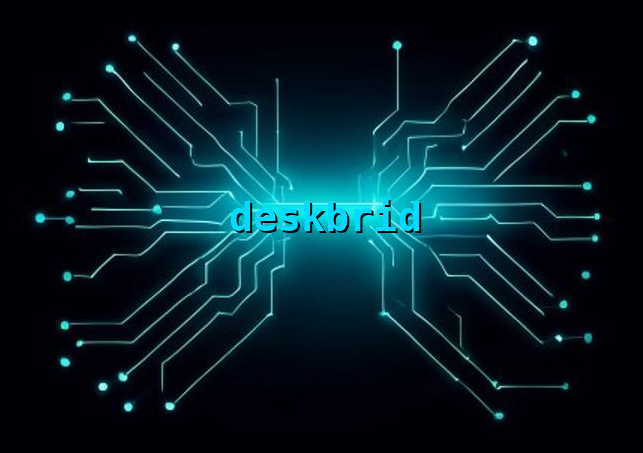

# deskbrid

<p align="center">
  
</p>

<p align="center">
  <a href="https://github.com/coe0718/deskbrid/actions"></a>
  <a href="LICENSE"></a>
  <a href="https://www.rust-lang.org"></a>
</p>

<p align="center">
  <a href="https://deskbrid.patchhive.dev"><strong>deskbrid.patchhive.dev</strong></a>
</p>

**The HAL your Linux desktop agents are missing.**

Deskbrid is a single Rust binary that auto-detects your desktop environment and wraps it into a JSON-over-Unix-socket protocol. GNOME, Hyprland, KDE, Cinnamon, MATE — one daemon, one protocol, one binary.

```bash
# Human
deskbrid windows list
deskbrid clipboard read

# Agent (same socket)
{"action": "windows.list"}  →  [{"title": "VS Code", "app_id": "code", ...}]
```

## Why

Every major AI lab is racing to ship desktop agents. AppleScript gives macOS agents native control. Windows has UI Automation. Linux has `xdotool` — which breaks on Wayland, the default display protocol for every major distro.

Deskbrid fills that gap. It auto-detects your compositor and loads the right backend — GNOME (Mutter RemoteDesktop DBus), Hyprland (hyprctl + ydotool + grim), or KDE (KWin D-Bus + ydotool + spectacle). Same binary, same protocol, same socket.


## Quick start

### Pre-built binary

Download the latest release binary from the [releases page](https://github.com/coe0718/deskbrid/releases):

```bash
# Pick your version — replace v0.6.0 with the latest tag
curl -LO https://github.com/coe0718/deskbrid/releases/download/v0.6.0/deskbrid
chmod +x deskbrid
sudo mv deskbrid /usr/local/bin/
```

Or build from source if you prefer.

### GNOME
```bash
git clone https://github.com/coe0718/deskbrid
cd deskbrid

# System deps
sudo apt install -y grim wl-clipboard

# Install GNOME Shell extension
cp -r extensions/deskbrid@deskbrid ~/.local/share/gnome-shell/extensions/
gnome-extensions enable deskbrid@deskbrid
# Log out and back in (or Alt+F2 → r on X11)

# Build and run
cargo build --release
./target/release/deskbrid daemon &

# Test it
./target/release/deskbrid windows list
./target/release/deskbrid system info
```

### Hyprland
```bash
git clone https://github.com/coe0718/deskbrid
cd deskbrid

# System deps
sudo pacman -S grim wl-clipboard ydotool   # Arch
# or
sudo apt install grim wl-clipboard          # Debian — install ydotool from source

# Fix /dev/uinput permissions (ydotool needs write access)
echo 'KERNEL=="uinput", GROUP="input", MODE="0660"' | sudo tee /etc/udev/rules.d/99-input.rules
sudo udevadm control --reload-rules
sudo chmod 0660 /dev/uinput && sudo chgrp input /dev/uinput
sudo usermod -aG input $USER  # log out and back in

# Add ydotoold to your Hyprland config
echo 'exec-once = ydotoold' >> ~/.config/hypr/hyprland.conf

# Build and run
cargo build --release
./target/release/deskbrid daemon &

# Test it
./target/release/deskbrid windows list
./target/release/deskbrid screenshot
```

### KDE Plasma
```bash
git clone https://github.com/coe0718/deskbrid
cd deskbrid

# System deps
sudo apt install spectacle imagemagick wl-clipboard ydotool   # Debian
# or
sudo pacman -S spectacle imagemagick wl-clipboard ydotool     # Arch

# ydotoold must run as user (not root). Add to KDE autostart:
mkdir -p ~/.config/autostart
cat > ~/.config/autostart/ydotoold.desktop << 'EOF'
[Desktop Entry]
Type=Application
Name=ydotoold
Exec=ydotoold
Terminal=false
X-KDE-autostart-phase=2
EOF

# Fix /dev/uinput permissions (ydotool needs write access)
echo 'KERNEL=="uinput", GROUP="input", MODE="0660"' | sudo tee /etc/udev/rules.d/99-input.rules
sudo udevadm control --reload-rules
sudo chmod 0660 /dev/uinput && sudo chgrp input /dev/uinput
sudo usermod -aG input $USER  # log out and back in

# Build and run
cargo build --release
./target/release/deskbrid daemon &

# Test it
./target/release/deskbrid windows list
./target/release/deskbrid screenshot
```

## Auto-setup

Deskbrid provides a `setup` subcommand that auto-detects your desktop and configures dependencies:

```bash
deskbrid setup
```

What it does per desktop:

| Desktop | Action |
|---------|--------|
| **GNOME** | Installs the Shell extension to `~/.local/share/gnome-shell/extensions/` and enables it |
| **Hyprland** | Prints ydotool setup tips (udev rules, `exec-once` config) |
| **KDE** | Prints ydotoold autostart tips (XDG autostart file, udev rules) |
|   |
```bash
# Example output on KDE
$ deskbrid setup
Detected desktop: KDE
ℹ  Install dependencies: sudo apt install spectacle imagemagick wl-clipboard ydotool
ℹ  Add ydotoold autostart: see DEPENDENCIES.md
ℹ  Fix /dev/uinput permissions: sudo usermod -aG input $USER
```
```

## Permissions (v0.5.0)

Deskbrid v0.5.0 adds scoped, per-UID permission gating. By default (no config file) all actions are allowed for backward compatibility. When a permissions file exists, the daemon checks every action against the caller's UID via `SO_PEERCRED`.

### Config location

```
~/.config/deskbrid/permissions.toml
```

### Example config

```toml
# Allow everything to UID 1000 (default user)
[permissions.1000]
allow = ["*"]

# Restrict a secondary user to read-only operations
[permissions.1001]
allow = ["windows.*", "workspaces.list", "system.*"]

# Grant input and clipboard to a specific agent UID
[permissions.1002]
allow = [
    "windows.*",
    "workspaces.*",
    "input.*",
    "clipboard.*",
    "screenshot",
    "system.info",
    "system.idle",
    "notifications.*",
]
```

### How it works

| Concept | Behavior |
|---------|----------|
| **No file** | All actions allowed (backward compatible) |
| **Empty file** | All actions denied for all UIDs |
| **Missing UID** | All actions denied for that UID |
| **Glob patterns** | `*`, `windows.*`, `input.keyboard`, etc. |
| **Multiple patterns** | Any match = allow; no match = deny |
| **Deny override** | Deny always takes precedence over allow |

### Permission names

Full list of available permission names:

```
windows.list, windows.focus, windows.get, windows.close, windows.minimize, windows.maximize, windows.move_resize, windows.activate_or_launch
workspaces.list, workspaces.switch, workspaces.move_window
layout_profiles.list, layout_profiles.get, layout_profiles.save, layout_profiles.delete, layout_profiles.restore
input.keyboard, input.mouse
clipboard.read, clipboard.write
screenshot
notifications.send, notifications.close
system.info, system.idle, system.power, system.battery
network.status, network.interfaces, network.wifi_scan, network.wifi_connect
bluetooth.list, bluetooth.scan, bluetooth.stop_scan, bluetooth.connect, bluetooth.disconnect, bluetooth.pair, bluetooth.forget
files.watch, files.unwatch, files.search
process.list, process.start
hotkeys.register, hotkeys.unregister
audio.list_sinks, audio.set_sink_volume
monitor.list, location.get
```

### Error response

When an action is denied, the daemon returns:

```json
{"type": "response", "status": "error", "error": {"code": "PERMISSION_DENIED", "message": "Caller UID 1001 not allowed: input.keyboard"}}
```

## Supported desktops
| Desktop | Session | Status | Backend |
|---------|---------|--------|---------|
| **GNOME 46+** | Wayland | ✅ Supported | Mutter RemoteDesktop + Shell Extension |
| **Hyprland** | Wayland | ✅ Supported (v0.3.0) | hyprctl + ydotool + grim |
| **KDE Plasma** | Wayland | ✅ Supported (v0.4.0) | KWin D-Bus + ydotool + spectacle |
| Cinnamon | X11 | 🔄 Planned | xdotool + wmctrl + xprop + xclip |
| MATE | X11 | 🔄 Planned | xdotool + wmctrl + xprop + xclip |
| X11 (generic) | X11 | 🔄 Planned | xdotool + wmctrl + import |

Deskbrid auto-detects your desktop at startup (`$XDG_CURRENT_DESKTOP` → process scan → GNOME fallback). No config files, no flags.

## What it can do

### 🖥️ Windows & Workspaces
| Action | Description |
|---|---|
| `windows.list` | List all open windows (title, app_id, workspace, geometry) |
| `windows.focus` | Focus a window by app_id, title substring, or hex address |
| `windows.get` | Get details for a specific window |
| `windows.close` | Request that a window close |
| `windows.minimize` | Minimize a window where the compositor supports it |
| `windows.maximize` | Maximize a window |
| `windows.move_resize` | Move and resize a window |
| `windows.activate_or_launch` | Focus an app if open, launch it if not |
| `workspaces.list` | List workspaces |
| `workspaces.switch` | Switch to a workspace |
| `workspaces.move_window` | Move a window to another workspace |

`windows.activate_or_launch` may start a process, so permission-gated deployments must grant both `windows.activate_or_launch` and `process.start`.

### 🧩 Layout Profiles
| Action | Description |
|---|---|
| `layout_profiles.save` | Save current windows, monitors, workspaces, and active workspace |
| `layout_profiles.list` | List saved layout profile summaries |
| `layout_profiles.get` | Get a saved layout profile snapshot |
| `layout_profiles.restore` | Restore saved workspace placement, window geometry, minimized state, and active workspace |
| `layout_profiles.delete` | Delete a saved layout profile |

Profiles are stored in `~/.config/deskbrid/layout_profiles/`. Restores compare monitor topology and report mismatches; monitor mode changes are not applied yet. Permission-gated deployments should grant `windows.list`, `workspaces.list`, and `system.info` for saving, and window/workspace control permissions for restoring.

### ⌨️ Input
| Action | Description |
|---|---|
| `input.keyboard type` | Type text into the focused window |
| `input.keyboard key` | Send a single keypress |
| `input.keyboard combo` | Send key combos (ctrl+l, super+space, alt+tab) |
| `input.mouse move` | Move mouse to absolute position |
| `input.mouse click` | Click (left/middle/right) |
| `input.mouse scroll` | Scroll (dx/dy) |

### 📋 Clipboard · 📸 Screenshots · 🔔 Notifications
| Action | Description |
|---|---|
| `clipboard.read` | Read Wayland clipboard |
| `clipboard.write` | Write to Wayland clipboard |
| `screenshot` | Capture screen (full, monitor, region, or window) |
| `notification.send` | Send a desktop notification |
| `notification.close` | Close a notification by ID |

### ⚙️ System · 🌐 Network · 📡 Bluetooth · 🎵 Audio · 📁 Files
| Action | Description |
|---|---|
| `system.info` | Desktop info (compositor, version, monitors, workspaces) |
| `system.idle` | Seconds since last user input |
| `system.battery` | Battery percentage, state, time remaining |
| `system.power` | Suspend, hibernate, shutdown, reboot, lock, logout |
| `network.status` | Online/offline via NetworkManager |
| `network.interfaces` | List interfaces with IPs |
| `network.wifi.scan` | Scan for WiFi networks |
| `network.wifi.connect` | Connect to a WiFi network |
| `bluetooth.list` | List known/available devices |
| `bluetooth.scan` | Start device discovery |
| `bluetooth.connect` | Connect to a device |
| `audio.list_sinks` | List audio output devices |
| `audio.set_sink_volume` | Set sink volume (0.0-1.0) |
| `files.search` | Search files by name |
| `files.watch` | Watch a path for changes (creates, modifies, deletes) |
| `files.unwatch` | Stop watching a path |

### 📡 Events (subscribe)
```json
{"action": "subscribe", "events": ["file.*"]}
```
| Pattern | What you get |
|---|---|
| `file.*` | file.created, file.modified, file.deleted |
| `file.created` | Just file creation events |
| `*` | Everything |

## Real-world example: an AI agent controlling VS Code

```
→ {"action": "windows.list"}
← [{"title": "PatchHive — VS Code", "app_id": "code", ...},
   {"title": "praxis — VS Code", "app_id": "code", ...}]

→ {"action": "windows.focus", "window_id": "code"}
← {"type": "response", "status": "ok"}

→ {"action": "input.mouse", "action": "move", "x": 900, "y": 920}
→ {"action": "input.mouse", "action": "click", "button": "left"}
→ {"action": "input.keyboard", "action": "type", "text": "Fix the build errors\n"}
```

The agent picks the right window by title substring, brings it to front, clicks into the chat input, and types. Works identically on GNOME, Hyprland, and KDE.

## Client libraries

| Language | Status | Install |
|---|---|---|
| **Python** | ✅ Done | `pip install ./clients/python/` |
| **Rust** (built-in CLI) | ✅ Done | CLI included in binary |
| TypeScript | 🔄 Planned | `npm install deskbrid` |

### Python example

```python
from deskbrid import Deskbrid

client = Deskbrid()

# Subscribe to events
@client.on("file.*")
def on_file_change(event):
    print(f"File changed: {event['path']}")

# Actions
client.windows_list()
client.keyboard_type("deploy production\n")
text = client.clipboard_read()
path = client.screenshot()

client.listen()  # blocks, streaming events
```

## How it works

Deskbrid binds a Unix socket at `$XDG_RUNTIME_DIR/deskbrid.sock`. Every interaction is one JSON line in → one JSON line out. Agents subscribe to events and get pushed real-time updates.

At startup, deskbrid auto-detects your desktop environment and loads the matching backend:

- **GNOME** — talks to Mutter RemoteDesktop (input injection), the GNOME Shell extension (windows/workspaces), and standard Linux utilities (grim, wl-clipboard, NetworkManager, BlueZ)
- **Hyprland** — uses `hyprctl` (JSON CLI) for windows/workspaces, `ydotool` for input, `grim` for screenshots, `wl-copy/wl-paste` for clipboard, and standard Linux utilities for everything else
- **KDE** — uses KWin D-Bus + scripting API for windows/workspaces, `ydotool` for input (run ydotoold as user, not root), `spectacle` + ImageMagick `convert` for screenshots, `wl-copy/wl-paste` for clipboard, and standard Linux utilities for everything else
- **Cinnamon / MATE / X11** — planned, will use xdotool, wmctrl, xclip, and X11 utilities

## Compared to alternatives

| Tool | Wayland | Agent-native | JSON protocol | Windows | Input | Clipboard | Screenshot | Bluetooth | Audio | File watch |
|---|---|---|---|---|---|---|---|---|---|---|
| **deskbrid** | ✅ | ✅ | ✅ | ✅ | ✅ | ✅ | ✅ | ✅ | ✅ | ✅ |
| xdotool | ❌ | ❌ | ❌ | ✅ | ✅ | ❌ | ❌ | ❌ | ❌ | ❌ |
| ydotool | ✅ | ❌ | ❌ | ❌ | ✅ | ❌ | ❌ | ❌ | ❌ | ❌ |
| wtype | ✅ | ❌ | ❌ | ❌ | ✅ | ❌ | ❌ | ❌ | ❌ | ❌ |
| grim | ✅ | ❌ | ❌ | ❌ | ❌ | ❌ | ✅ | ❌ | ❌ | ❌ |
| wl-clipboard | ✅ | ❌ | ❌ | ❌ | ❌ | ✅ | ❌ | ❌ | ❌ | ❌ |
| atspi | limited | ❌ | ❌ | limited | ❌ | ❌ | ❌ | ❌ | ❌ | ❌ |

Deskbrid is the only tool that combines all of these into a single daemon with a structured protocol designed for programmatic use — and it works on GNOME, Hyprland, and KDE.

## Full protocol

See **[PROTOCOL.md](PROTOCOL.md)** for the complete JSON-over-socket specification.

## License

MIT
